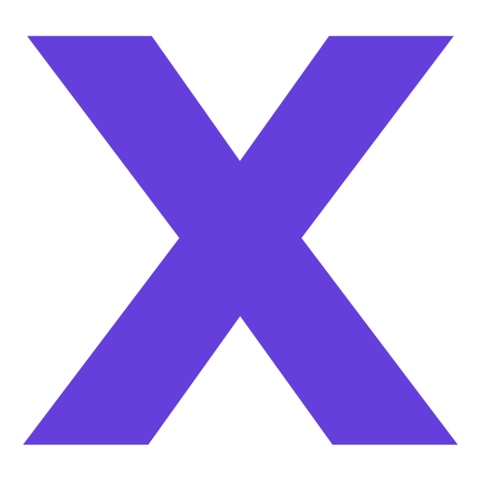
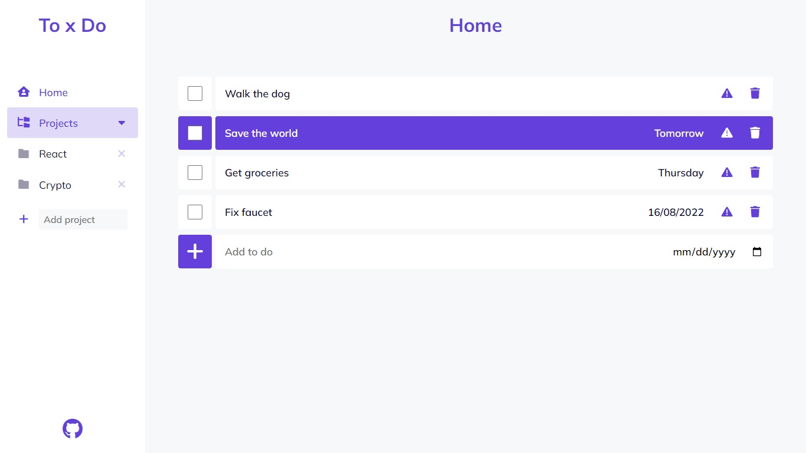
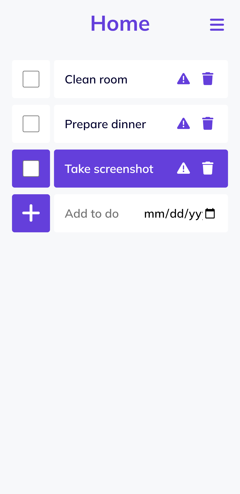

<div align="center">
  
  <h1>To x Do: Task tracking app</h1>

  <p>
  Keep track of tasks with custom project folders
  </p>

  <p>
    <a href="https://github.com/danxschz/to-do-list/graphs/contributors">
      
    </a>
    <a href="https://github.com/danxschz/to-do-list/commits/main">
      
    </a>
    <a href="https://github.com/danxschz/to-do-list/blob/master/LICENSE">
      
    </a>
  </p>

  <h4>
    <a href="https://danxschz.github.io/to-do-list">View Demo</a>
    <span> · </span>
    <a href="https://github.com/danxschz/to-do-list/issues/">Report Bug</a>
  </h4>
</div>

<br>

## About the Project

### Screenshots

<div align="center">
  <h3>Desktop</h3>
  

  <h3>Mobile</h3>
  
</div>

### Built With

- HTML
- CSS
- JavaScript
- Sass
- npm
- webpack
- Web Storage API

### Color Reference

| Color             | Hex                                                                |
| ----------------- | ------------------------------------------------------------------ |
| Background | #F7F8FA |
| Primary | #643FDB |
| Text | #01002D |

## Getting Started

### Run Locally

In order to setup and work on this project on your own, you will need to:

Clone the project

```bash
  git clone https://github.com/danxschz/to-do-list.git
```

Go to the project directory

```bash
  cd to-do-list
```

Install dependencies

```bash
  npm install
```

## Usage

- Save to-do items to the default project (Home) or create a custom folder
- View to-do details, check off and delete items
- Toggle priority between normal and important on to-do items
- Data saved to local storage

## License

Distributed under the MIT License. See LICENSE for more information.

## Contact

Daniel Sanchez (@danxschz) - danxschz@gmail.com